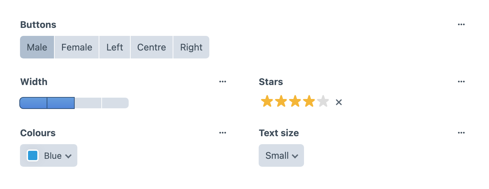

<!-- feature-intro -->
Button Box replaces fiddly free-text settings with compact, visual Craft fields. Give authors clear choices for buttons, colours, widths, text sizes, ratings, and trigger-style options.
<!-- feature-intro-end -->

<!-- feature-section media-size="large" media-shadow="false" -->
## Visual field choices

Present approved options as recognisable controls instead of asking editors to remember class names or magic values. The stored value remains predictable for templates while the field itself communicates what each choice means.

<!-- feature-section-end -->

<!-- feature-grid -->
- :icon[toggle-right] **Button choices** Present labelled options in a compact button group.
- :icon[palette] **Colour choices** Give authors a visual palette backed by stable template values.
- :icon[text-size] **Text sizes** Offer the typography sizes your design system actually supports.
- :icon[star] **Stars and ratings** Capture familiar rating-style values with an immediate visual control.
- :icon[arrows-horizontal] **Widths** Let authors choose from approved width or alignment options.
- :icon[bolt] **Triggers** Model small on-or-off or action-oriented choices without a generic dropdown.
<!-- feature-grid-end -->
